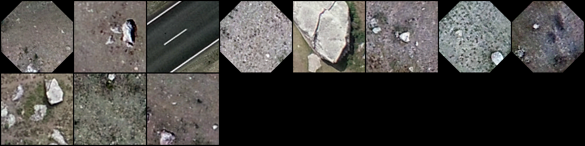
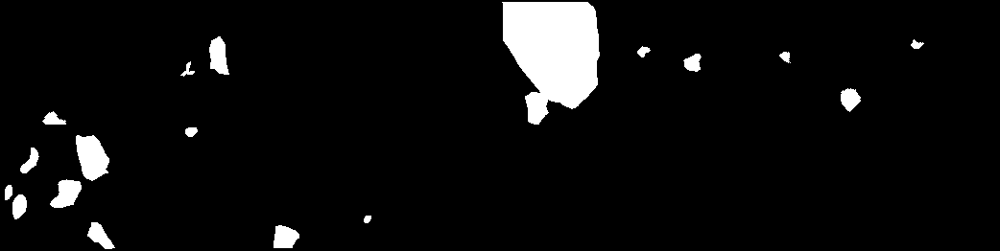
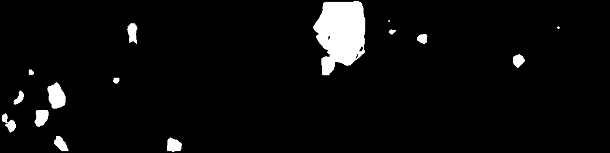

# Rocks segmentation with U-Net
This model is supposed to segmentate rocks in images made via flying drone. Since [dice score](https://en.wikipedia.org/wiki/S%C3%B8rensen%E2%80%93Dice_coefficient) is around 0.90 I can assure you that this model is pretty bad. 
My results you can see here down below



But if you want to try it on your own follow this instructions:

**Clone this repo**
```
git clone https://github.com/svetadomoi/unet-rocks-segmentation.git
```
**Install libraries**
```
pip install -r requirements.txt
```

**Download suitable GDAL wheel file from [here](https://www.lfd.uci.edu/~gohlke/pythonlibs/#gdal) (It's important not to change wheel file name), open cmd and navigate to the directory where you downloaded the file. Install it via**
```
pip install path-to-wheel-file.whl
```

**If you want to augmentate your images, do it via**
```
python augment.py
```
**After that you can train the model**
```
python train.py
```